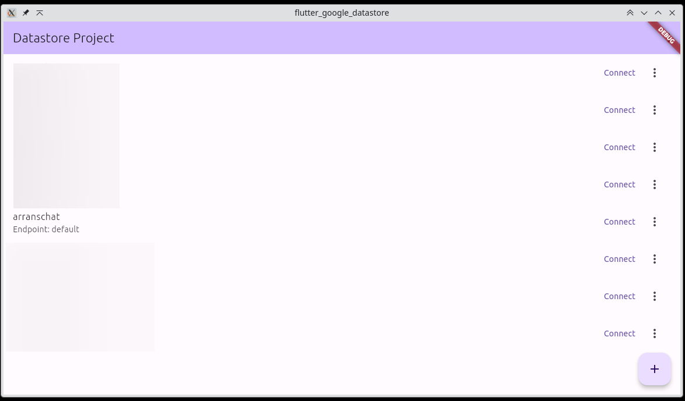
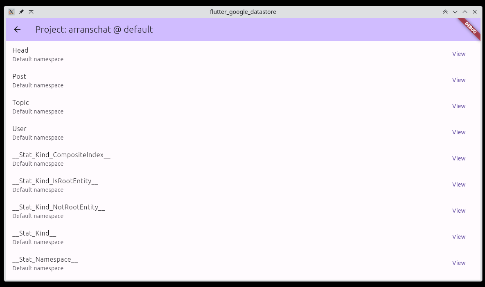
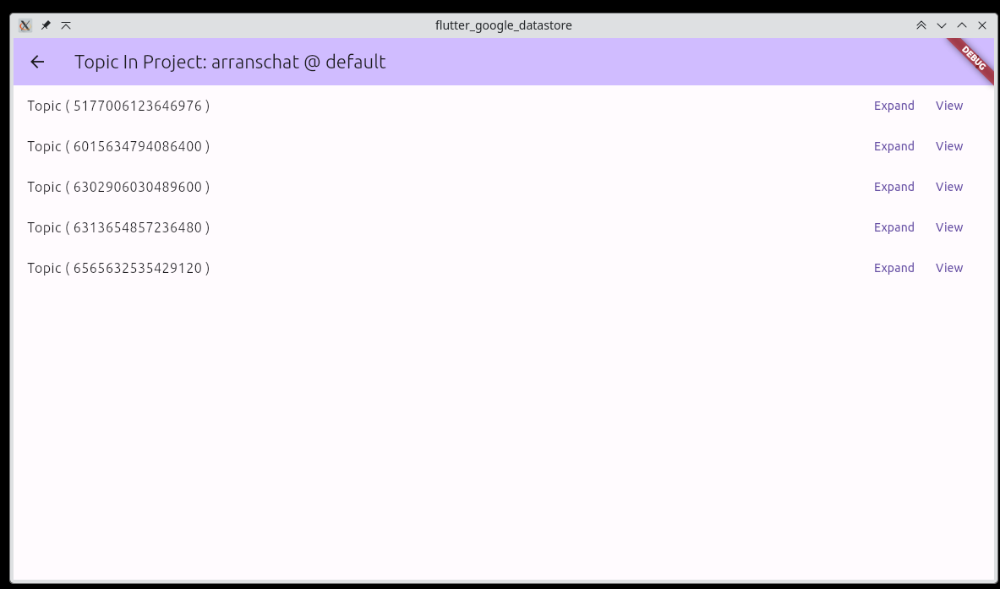
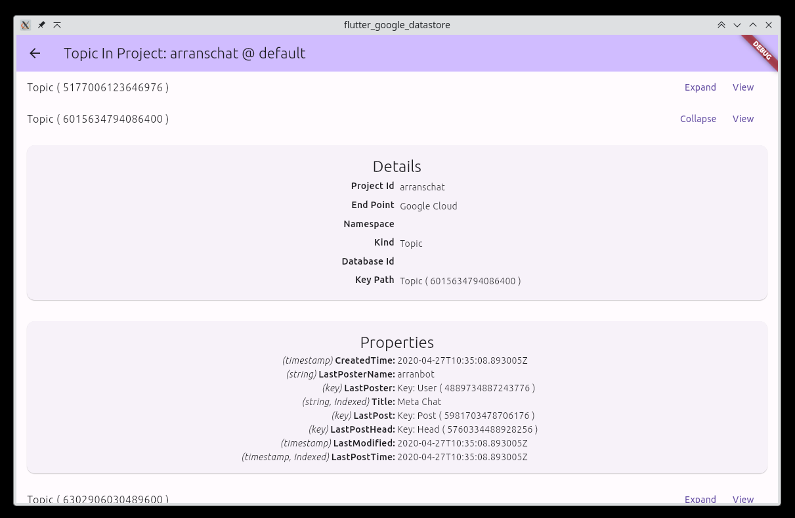
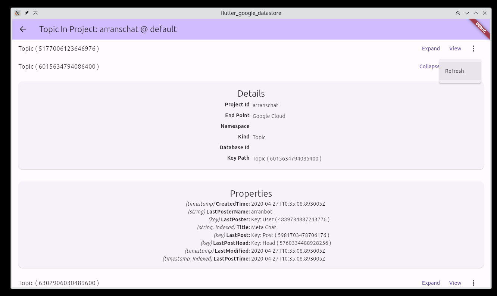
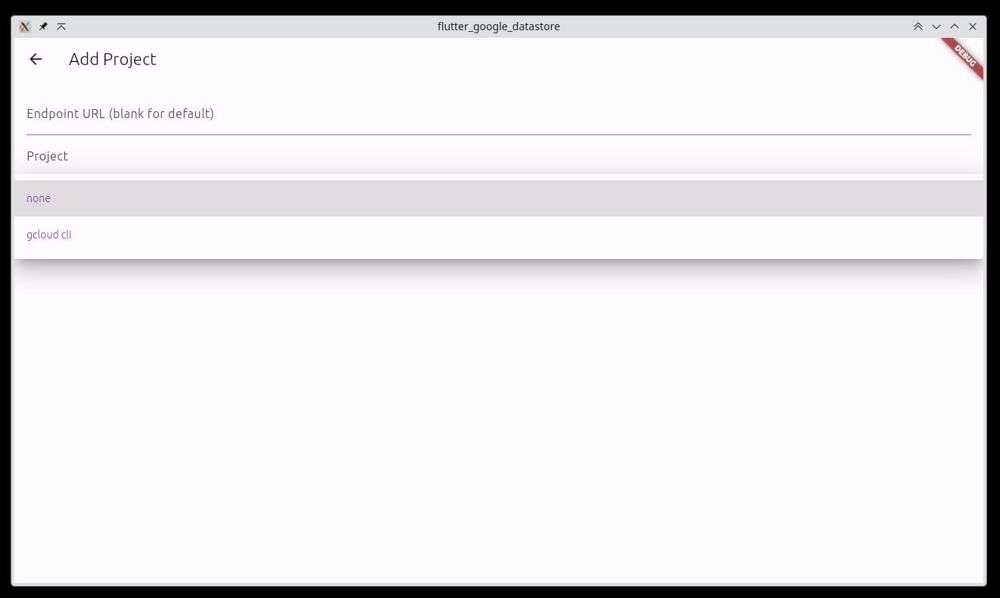

# flutter_google_datastore

A flutter project to browse a google datastore, namely the datastore emulator which seemed to lack
a client however supports connecting to a cloud instance.

(UI is in need of some adjustments but it works for me right now)

See releases, should work on Linux, Mac, Windows, Android and iOS.

## Building
This project uses [FastForge](https://pub.dev/packages/fastforge) (formerly
Flutter Distributor) to package releases. The workflow in
`.github/workflows/release.yaml` runs FastForge automatically. For local
builds you can install the tool with `dart pub global activate fastforge` and
invoke `fastforge release` for the desired target.

# Roadmap
* More authentication methods including android compatible Oauth2
* Ability to create an entity
* Export and import of multiple types both datastore / could and it's own

This project was born out of a personal need, and I welcome sponsorship to help enhance and maintain it for a wider audience.
